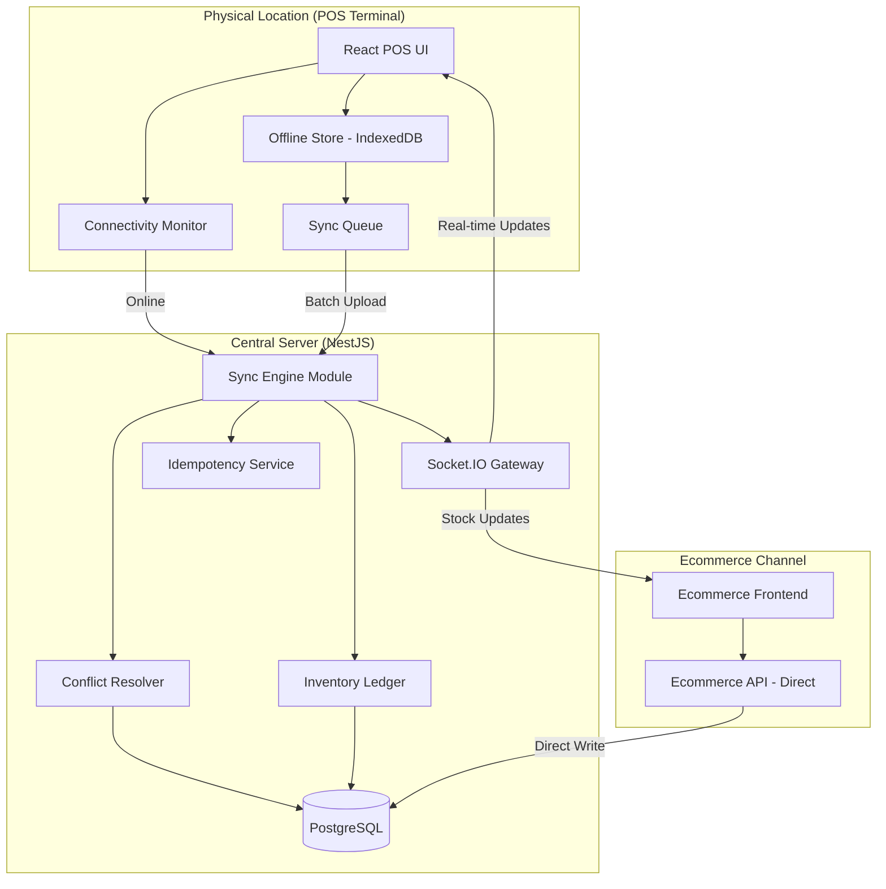
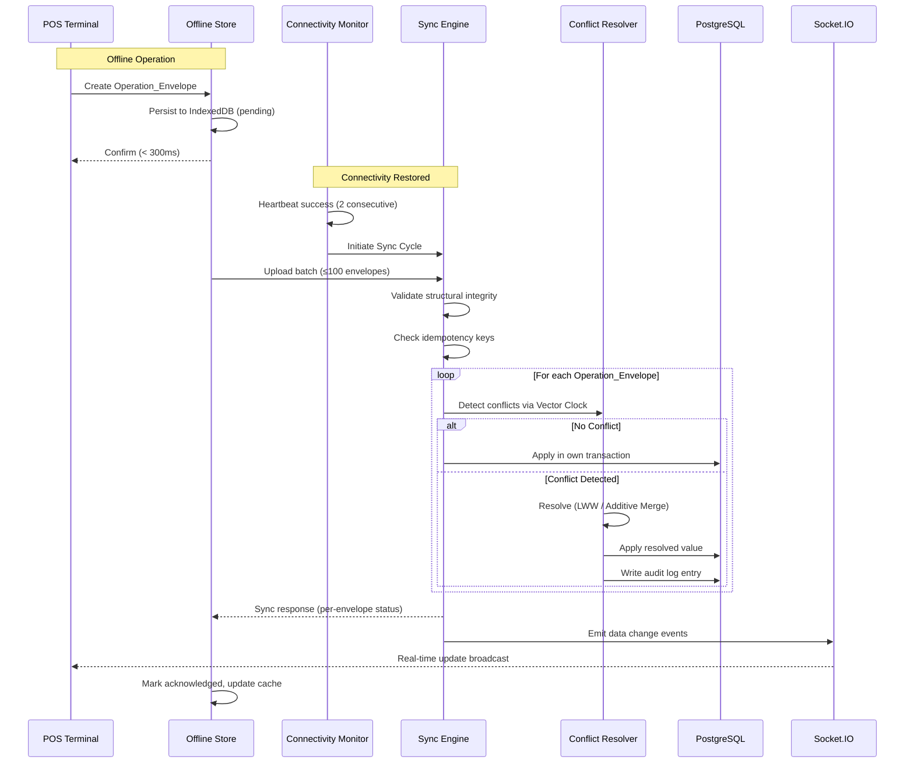

# Design Document: Offline Sync

## Overview

This design implements an offline-first synchronization system for the Zenvix multi-location retail platform. The system enables POS terminals at physical retail locations to continue operating during internet outages by persisting operations locally in IndexedDB, then automatically reconciling with the central PostgreSQL database when connectivity restores.

The architecture follows a hub-and-spoke model: each Location_Node operates independently with a local Offline_Store, while the central Sync_Engine arbitrates conflicts and maintains the authoritative state. The Ecommerce_Channel bypasses the offline queue entirely, writing directly to the central database to guarantee always-online order processing.

Key design decisions:
- **IndexedDB per tenant** for client-side storage with encryption at rest
- **Operation_Envelope pattern** wrapping every offline mutation with metadata for idempotent replay
- **Vector clocks** for causal ordering and conflict detection across locations
- **Hybrid conflict resolution**: last-writer-wins for metadata/pricing, additive merge for stock deductions
- **NestJS module integration** extending the existing `support/sync` module with queue processing, conflict resolution, and real-time notification via the existing Socket.IO infrastructure

## Architecture



### Sync Flow Sequence



## Components and Interfaces

### 1. Offline Store (Frontend - `src/lib/offline-store/`)

Manages local persistence via IndexedDB, scoped per tenant.

```typescript
// src/lib/offline-store/types.ts
interface OperationEnvelope {
  id: string;                    // UUID v4
  idempotencyKey: string;        // Unique per operation
  tenantId: string;
  branchId: string;
  locationId: string;
  sequenceNumber: number;        // Monotonic per offline session
  sessionId: string;             // Offline session identifier
  timestamp: string;             // ISO 8601 from client clock
  vectorClock: VectorClock;      // Causal ordering
  operationType: OperationType;
  payload: Record<string, unknown>;
  status: EnvelopeStatus;
  retryCount: number;
  createdAt: string;
  encryptedPayload?: ArrayBuffer; // AES-GCM encrypted form
}

type EnvelopeStatus = 'pending' | 'syncing' | 'acknowledged' | 'failed';

type OperationType = 
  | 'pos_transaction'
  | 'inventory_adjustment'
  | 'stock_movement'
  | 'stock_deduction'
  | 'price_update'
  | 'customer_update';

interface VectorClock {
  [locationId: string]: number;  // Logical counter per location
}

interface OfflineStoreConfig {
  tenantId: string;
  branchId: string;
  locationId: string;
  offlineToleranceThreshold: number; // Default: 500, range: 100-2000
  retentionDays: number;             // Default: 7
}
```

```typescript
// src/lib/offline-store/offline-store.service.ts
interface IOfflineStore {
  // Queue operations
  enqueue(operation: Omit<OperationEnvelope, 'id' | 'sequenceNumber' | 'status' | 'createdAt'>): Promise<OperationEnvelope>;
  getBatch(limit: number): Promise<OperationEnvelope[]>;
  markStatus(ids: string[], status: EnvelopeStatus): Promise<void>;
  getPendingCount(): Promise<number>;
  
  // Read cache
  getProduct(productId: string): Promise<Product | null>;
  getPrice(productId: string): Promise<PriceRecord | null>;
  getCustomer(customerId: string): Promise<Customer | null>;
  updateCache(entity: string, records: Record<string, unknown>[]): Promise<void>;
  
  // Lifecycle
  initialize(config: OfflineStoreConfig): Promise<void>;
  verifyIntegrity(): Promise<IntegrityReport>;
  purgeAcknowledged(beforeDate: Date): Promise<number>;
  close(): Promise<void>;
}

interface IntegrityReport {
  totalEnvelopes: number;
  validEnvelopes: number;
  corruptEnvelopes: number;
  recoveredEnvelopes: number;
  orphanedEntries: number;
}
```

### 2. Connectivity Monitor (Frontend - `src/lib/connectivity/`)

Detects network state and orchestrates sync cycles.

```typescript
// src/lib/connectivity/connectivity-monitor.service.ts
interface IConnectivityMonitor {
  start(config: ConnectivityConfig): void;
  stop(): void;
  getStatus(): ConnectivityStatus;
  onStatusChange(callback: (status: ConnectivityStatus) => void): () => void;
  triggerManualSync(): Promise<SyncResult>;
}

interface ConnectivityConfig {
  heartbeatUrl: string;
  heartbeatInterval: number;   // Default: 10s, range: 5-60s
  heartbeatTimeout: number;    // 3 seconds
  batchSize: number;           // Default: 50
  batchInterval: number;       // Default: 30s, range: 10-120s
  maxRetries: number;          // 3
}

type ConnectivityStatus = 'online' | 'syncing' | 'pending' | 'offline';

interface SyncResult {
  success: boolean;
  acknowledged: number;
  failed: number;
  errors: SyncError[];
}

interface SyncError {
  envelopeId: string;
  idempotencyKey: string;
  reason: string;
}
```

### 3. Sync Engine (Backend - `src/support/sync/`)

Extends the existing NestJS sync module with operation processing.

```typescript
// backend/src/support/sync/sync-engine.service.ts
interface ISyncEngine {
  processBatch(batch: OperationEnvelope[], tenantContext: TenantContext): Promise<BatchSyncResponse>;
  getHealthMetrics(locationId: string): Promise<SyncHealthMetrics>;
  getReconciliationReport(tenantId: string): Promise<ReconciliationReport>;
}

interface BatchSyncResponse {
  batchId: string;
  processedAt: string;
  results: EnvelopeResult[];
}

interface EnvelopeResult {
  idempotencyKey: string;
  status: 'acknowledged' | 'failed';
  reason?: string;
}

interface SyncHealthMetrics {
  locationId: string;
  lastSyncTimestamp: string | null;
  pendingOperationCount: number;
  failedOperationCount: number;
  averageSyncLatencyMs: number; // Rolling 60-min window
}
```

### 4. Conflict Resolver (Backend - `src/support/sync/`)

Detects and resolves concurrent modifications using vector clocks.

```typescript
// backend/src/support/sync/conflict-resolver.service.ts
interface IConflictResolver {
  detectConflict(envelope: OperationEnvelope, currentState: RecordState): ConflictResult;
  resolve(conflict: ConflictResult, envelope: OperationEnvelope): ResolvedValue;
}

interface RecordState {
  recordId: string;
  vectorClock: VectorClock;
  currentValues: Record<string, unknown>;
  lastSyncBaseQuantity?: number; // For additive merge
}

type ConflictResult = 
  | { type: 'no_conflict' }
  | { type: 'concurrent_write'; strategy: ResolutionStrategy; field: string }
  | { type: 'unresolvable'; reason: string };

type ResolutionStrategy = 'last_writer_wins' | 'additive_merge';

interface ResolvedValue {
  finalValue: Record<string, unknown>;
  mergedVectorClock: VectorClock;
  auditEntry: ConflictAuditEntry;
}

interface ConflictAuditEntry {
  recordId: string;
  conflictType: string;
  originalValues: Record<string, unknown>;
  conflictingValues: Record<string, unknown>;
  strategy: ResolutionStrategy;
  finalValues: Record<string, unknown>;
  resolvedAt: string;
  sourceLocationId: string;
}
```

### 5. Encryption Service (Frontend - `src/lib/offline-store/`)

Handles tenant-specific encryption for local data.

```typescript
// src/lib/offline-store/encryption.service.ts
interface IEncryptionService {
  deriveKey(authToken: string, tenantId: string): Promise<CryptoKey>;
  encrypt(data: Record<string, unknown>, key: CryptoKey): Promise<ArrayBuffer>;
  decrypt(encrypted: ArrayBuffer, key: CryptoKey): Promise<Record<string, unknown>>;
}
```

### 6. Ecommerce Channel Guard (Backend)

Ensures ecommerce orders bypass offline mechanisms entirely.

```typescript
// backend/src/modules/retail/ecommerce-channel.guard.ts
interface IEcommerceChannelGuard {
  validateStock(productId: string, quantity: number, tenantId: string): Promise<StockValidation>;
  getReservedThreshold(productId: string, tenantId: string): Promise<number>;
}

interface StockValidation {
  available: boolean;
  currentStock: number;
  reservedForEcommerce: number;
  effectiveAvailable: number;
}
```

## Data Models

### PostgreSQL Schema Extensions

```sql
-- Operation log for audit and replay
CREATE TABLE sync_operation_log (
  id UUID PRIMARY KEY DEFAULT gen_random_uuid(),
  tenant_id UUID NOT NULL REFERENCES companies(id),
  branch_id UUID NOT NULL,
  location_id UUID NOT NULL,
  idempotency_key VARCHAR(255) NOT NULL,
  sequence_number INTEGER NOT NULL,
  session_id UUID NOT NULL,
  operation_type VARCHAR(50) NOT NULL,
  payload JSONB NOT NULL,
  vector_clock JSONB NOT NULL,
  status VARCHAR(20) NOT NULL DEFAULT 'received', -- received, applied, failed, rejected
  error_reason TEXT,
  received_at TIMESTAMPTZ NOT NULL DEFAULT NOW(),
  applied_at TIMESTAMPTZ,
  created_at TIMESTAMPTZ NOT NULL DEFAULT NOW(),
  
  CONSTRAINT uq_idempotency UNIQUE(tenant_id, idempotency_key)
);

CREATE INDEX idx_sync_op_log_tenant_location ON sync_operation_log(tenant_id, location_id);
CREATE INDEX idx_sync_op_log_received ON sync_operation_log(received_at);
CREATE INDEX idx_sync_op_log_status ON sync_operation_log(tenant_id, status);

-- Inventory ledger per product per location
CREATE TABLE sync_inventory_ledger (
  id UUID PRIMARY KEY DEFAULT gen_random_uuid(),
  tenant_id UUID NOT NULL REFERENCES companies(id),
  product_id UUID NOT NULL,
  location_id UUID NOT NULL,
  movement_type VARCHAR(30) NOT NULL, -- sale, intake, transfer_in, transfer_out, adjustment
  quantity_change DECIMAL(12,4) NOT NULL,
  running_balance DECIMAL(12,4) NOT NULL,
  operation_envelope_id UUID REFERENCES sync_operation_log(id),
  vector_clock JSONB NOT NULL,
  created_at TIMESTAMPTZ NOT NULL DEFAULT NOW(),
  
  CONSTRAINT uq_ledger_entry UNIQUE(tenant_id, product_id, location_id, operation_envelope_id)
);

CREATE INDEX idx_inv_ledger_product ON sync_inventory_ledger(tenant_id, product_id, location_id);

-- Conflict resolution audit trail
CREATE TABLE sync_conflict_log (
  id UUID PRIMARY KEY DEFAULT gen_random_uuid(),
  tenant_id UUID NOT NULL REFERENCES companies(id),
  record_id UUID NOT NULL,
  record_type VARCHAR(50) NOT NULL,
  conflict_type VARCHAR(50) NOT NULL,
  source_location_id UUID NOT NULL,
  original_values JSONB NOT NULL,
  conflicting_values JSONB NOT NULL,
  resolution_strategy VARCHAR(30) NOT NULL,
  final_values JSONB NOT NULL,
  resolved_at TIMESTAMPTZ NOT NULL DEFAULT NOW(),
  requires_manual_review BOOLEAN NOT NULL DEFAULT FALSE,
  reviewed_at TIMESTAMPTZ,
  reviewed_by UUID
);

CREATE INDEX idx_conflict_log_tenant ON sync_conflict_log(tenant_id, resolved_at);
CREATE INDEX idx_conflict_log_review ON sync_conflict_log(requires_manual_review) WHERE requires_manual_review = TRUE;

-- Sync session tracking per location
CREATE TABLE sync_sessions (
  id UUID PRIMARY KEY DEFAULT gen_random_uuid(),
  tenant_id UUID NOT NULL REFERENCES companies(id),
  location_id UUID NOT NULL,
  started_at TIMESTAMPTZ NOT NULL DEFAULT NOW(),
  completed_at TIMESTAMPTZ,
  operations_received INTEGER NOT NULL DEFAULT 0,
  operations_applied INTEGER NOT NULL DEFAULT 0,
  operations_failed INTEGER NOT NULL DEFAULT 0,
  latency_ms INTEGER,
  status VARCHAR(20) NOT NULL DEFAULT 'in_progress' -- in_progress, completed, failed
);

CREATE INDEX idx_sync_sessions_location ON sync_sessions(tenant_id, location_id, started_at DESC);

-- Ecommerce safety stock configuration
CREATE TABLE sync_ecommerce_reserve (
  id UUID PRIMARY KEY DEFAULT gen_random_uuid(),
  tenant_id UUID NOT NULL REFERENCES companies(id),
  product_id UUID NOT NULL,
  reserve_percentage DECIMAL(5,2) NOT NULL DEFAULT 20.00, -- 5-50%
  updated_at TIMESTAMPTZ NOT NULL DEFAULT NOW(),
  
  CONSTRAINT uq_ecom_reserve UNIQUE(tenant_id, product_id),
  CONSTRAINT chk_reserve_range CHECK (reserve_percentage >= 5 AND reserve_percentage <= 50)
);

-- Reconciliation flags
CREATE TABLE sync_reconciliation_flags (
  id UUID PRIMARY KEY DEFAULT gen_random_uuid(),
  tenant_id UUID NOT NULL REFERENCES companies(id),
  product_id UUID NOT NULL,
  affected_locations UUID[] NOT NULL,
  expected_total DECIMAL(12,4) NOT NULL,
  actual_total DECIMAL(12,4) NOT NULL,
  discrepancy DECIMAL(12,4) NOT NULL,
  flagged_at TIMESTAMPTZ NOT NULL DEFAULT NOW(),
  resolved_at TIMESTAMPTZ,
  resolved_by UUID
);

CREATE INDEX idx_recon_flags_open ON sync_reconciliation_flags(tenant_id) WHERE resolved_at IS NULL;
```

### IndexedDB Schema (Client-Side)

```typescript
// Database: `zenvix_offline_{tenantId}`
// Object Stores:

interface OfflineDBSchema {
  // Store: 'operations' - keyPath: 'id'
  operations: {
    key: string; // UUID
    value: OperationEnvelope;
    indexes: {
      'by-status': EnvelopeStatus;
      'by-sequence': [string, number]; // [sessionId, sequenceNumber]
      'by-idempotency': string;
    };
  };

  // Store: 'products' - keyPath: 'id'
  products: {
    key: string;
    value: CachedProduct;
    indexes: {
      'by-updated': string; // ISO timestamp
      'by-sku': string;
    };
  };

  // Store: 'prices' - keyPath: 'productId'  
  prices: {
    key: string;
    value: CachedPrice;
    indexes: {
      'by-updated': string;
    };
  };

  // Store: 'customers' - keyPath: 'id'
  customers: {
    key: string;
    value: CachedCustomer;
    indexes: {
      'by-accessed': string; // Last access timestamp for LRU
    };
  };

  // Store: 'metadata' - keyPath: 'key'
  metadata: {
    key: string;
    value: {
      key: string;
      value: unknown;
      updatedAt: string;
    };
  };
}
```


## Correctness Properties

*A property is a characteristic or behavior that should hold true across all valid executions of a system—essentially, a formal statement about what the system should do. Properties serve as the bridge between human-readable specifications and machine-verifiable correctness guarantees.*

### Property 1: Envelope Persistence Invariant

*For any* operation intercepted during offline mode, the resulting Operation_Envelope persisted in IndexedDB SHALL contain a valid UUID idempotency key, the correct tenant_id, branch_id, location_id, an ISO 8601 timestamp, the full original request payload, and a status field with value 'pending'.

**Validates: Requirements 1.1, 1.6**

### Property 2: Monotonic Sequence Ordering

*For any* sequence of operations enqueued within a single offline session, each operation's sequence number SHALL be strictly greater than the previous operation's sequence number, starting at 1 for the first operation, with no sequence number ever reused within the same session.

**Validates: Requirements 1.2**

### Property 3: Threshold Lockout with Read Fallback

*For any* Offline_Store whose pending operation count equals the configured offline_tolerance_threshold, new write operations (POS transactions, inventory adjustments, stock movements) SHALL be rejected, while read-only operations (product lookup, price checks) SHALL continue to succeed from the local cache.

**Validates: Requirements 1.4, 1.7**

### Property 4: Dual-Signal Connectivity State Machine

*For any* sequence of heartbeat results and Navigator.onLine states, the Connectivity_Monitor SHALL only declare offline status after two consecutive failed heartbeats, and SHALL only declare online status when both Navigator.onLine is true AND a heartbeat succeeds, never transitioning to offline on a single failure regardless of Navigator.onLine state.

**Validates: Requirements 2.1, 2.5**

### Property 5: Structural Validation Completeness

*For any* Operation_Envelope, if any required field (idempotency key, tenant_id, branch_id, location_id, timestamp, sequence number, operation payload) is missing or has an incorrect type, the Sync_Engine SHALL reject the envelope with an error reason identifying the specific invalid field, without modifying the database.

**Validates: Requirements 3.2, 3.9**

### Property 6: Idempotent Processing

*For any* valid Operation_Envelope submitted N times (N ≥ 1) to the Sync_Engine, exactly one database mutation SHALL be applied, and all subsequent submissions with the same idempotency key SHALL return 'acknowledged' status without re-processing.

**Validates: Requirements 3.3, 9.2**

### Property 7: Independent Batch Processing

*For any* batch of Operation_Envelopes where some operations fail (validation or application), all valid operations in the batch SHALL be committed independently, each failed operation SHALL have its error reason recorded, and the batch SHALL continue processing to completion regardless of individual failures.

**Validates: Requirements 3.4, 3.5**

### Property 8: Vector Clock Conflict Detection

*For any* pair of vector clocks (incoming operation vs. current record state), the Conflict_Resolver SHALL correctly classify the relationship as: no conflict (one strictly dominates the other or they are equal), concurrent write (neither dominates — conflict exists), based solely on the partial ordering defined by component-wise comparison of the vector clock entries.

**Validates: Requirements 4.1**

### Property 9: Last-Writer-Wins Determinism

*For any* two concurrent write operations on the same record (non-deduction inventory, non-quantity fields, or pricing fields), the Conflict_Resolver SHALL select the operation with the later timestamp as the winner, and when timestamps are identical, SHALL deterministically select using lexicographic comparison of Location_Node identifiers, producing the same result regardless of processing order.

**Validates: Requirements 4.2, 4.4, 4.5**

### Property 10: Additive Merge Commutativity

*For any* set of concurrent stock deductions from multiple locations applied against the same product, the final quantity SHALL equal the last acknowledged sync base quantity minus the sum of all deduction quantities, and this result SHALL be identical regardless of the order in which the deductions are processed.

**Validates: Requirements 4.3**

### Property 11: Conflict Audit Completeness

*For any* conflict that is automatically resolved by the Conflict_Resolver, an audit log entry SHALL be generated containing the original record values, the conflicting values from the incoming operation, the resolution strategy applied (last_writer_wins or additive_merge), and the final resulting value.

**Validates: Requirements 4.7**

### Property 12: Ecommerce Safety Stock Enforcement

*For any* ecommerce order and any physical location sync deduction, the system SHALL reject the operation that would cause the available quantity minus the product's configured reserve percentage (applied to total stock) to fall below zero, where ecommerce orders are validated at submission time and physical deductions are validated during sync conflict resolution.

**Validates: Requirements 5.2, 5.3**

### Property 13: Read-Your-Writes Consistency

*For any* record modified locally during offline operation, subsequent read requests SHALL return the locally modified version until the Sync_Engine acknowledges the modification, at which point reads SHALL return the server-confirmed version from the sync response.

**Validates: Requirements 6.6**

### Property 14: Inventory Ledger Completeness

*For any* inventory movement processed by the Sync_Engine (sale, intake, transfer, adjustment), a corresponding ledger entry SHALL be created recording the product_id, location_id, movement type, quantity change, and a reference to the source Operation_Envelope.

**Validates: Requirements 7.1**

### Property 15: Aggregate Inventory Consistency

*For any* product after sync completion, the aggregate inventory position SHALL equal the sum of all per-location balances for that product, and when the sum of location-level stock differs from the expected total based on recorded ledger movements by more than the configured tolerance, a reconciliation flag SHALL be created.

**Validates: Requirements 7.2, 7.3**

### Property 16: Integrity Verification Accuracy

*For any* IndexedDB store containing a mix of valid and corrupt Operation_Envelopes (missing status, missing sequence number, or missing idempotency key), the integrity verification SHALL correctly count and categorize all entries as valid, corrupt, or recovered, with the sum of categories equaling the total number of entries.

**Validates: Requirements 9.7**

### Property 17: Round-Trip Data Fidelity

*For any* valid operation payload, persisting it to the Offline_Store, syncing to the Sync_Engine, then reading the resulting record from the central database SHALL produce a record whose business-critical fields (amount, quantity, product reference, timestamp, tenant_id, location_id) are byte-for-byte identical to those that would result from direct online submission of the same payload.

**Validates: Requirements 9.8**

### Property 18: Tenant Data Isolation

*For any* two distinct tenants operating on the same device, operations stored for tenant A SHALL never be accessible when querying tenant B's store, and the Sync_Engine SHALL reject any Operation_Envelope whose tenant_id does not exactly match the authenticated session's tenant_id, logging a security event with the mismatched identifiers.

**Validates: Requirements 10.1, 10.2, 10.3**

### Property 19: Encryption Round-Trip

*For any* Operation_Envelope payload and a tenant-specific encryption key derived from an authentication token, encrypting then decrypting the payload with the same key SHALL produce an object identical to the original, and decrypting with a different tenant's key SHALL fail with a decryption error.

**Validates: Requirements 10.4**

## Error Handling

### Client-Side Errors

| Error Scenario | Handling Strategy | User Impact |
|---|---|---|
| IndexedDB write failure | Retry once, then display storage error notification | Operation not saved — prompt user to retry |
| IndexedDB quota exceeded | Display capacity warning, block new operations | Read-only mode until sync completes |
| Heartbeat timeout (single) | Increment failure counter, no state change | None — transparent |
| Heartbeat timeout (two consecutive) | Transition to offline state, emit event | Offline indicator shown |
| Sync batch upload fails | Exponential backoff retry (5s, 10s, 20s) × 3 | Syncing indicator, then error notification |
| Sync batch fails 5 times | Mark batch as failed, exclude from auto-sync | Error notification with manual retry option |
| Encryption key derivation fails | Block offline store access until re-auth | Prompt re-authentication |
| Cache miss on offline read | Return cache-miss indication to caller | Display "unavailable offline" in UI |
| Initial cache sync timeout (>60s) | Serve stale cache, show age notification | Stale data indicator with last sync timestamp |

### Server-Side Errors

| Error Scenario | Handling Strategy | Impact |
|---|---|---|
| Invalid Operation_Envelope structure | Reject with field-specific error, continue batch | Single operation fails, batch continues |
| Tenant_id mismatch | Reject, log security event, return 403 | Operation blocked, security alert |
| Duplicate idempotency key | Return acknowledged (idempotent replay) | None — transparent |
| Database constraint violation | Mark failed, record constraint error, continue batch | Single operation fails |
| Inventory lock timeout (>30s) | Abort product update, mark as concurrency timeout | Retry on next sync cycle |
| Socket.IO emission failure | Log warning, don't rollback committed data | Other nodes have delayed notification |
| Network interruption mid-batch | PostgreSQL transaction rollback, client resets to pending | Full batch retried next cycle |
| Ecommerce stock check failure (2× DB timeout) | Display maintenance page, suspend orders | Ecommerce temporarily unavailable |
| Reconciliation discrepancy detected | Create flag record, notify inventory manager | Manual review required |

### Recovery Procedures

1. **Corrupt IndexedDB entries**: Integrity check on startup identifies corrupt entries. Corrupt operations without valid idempotency keys are quarantined. Operations with partial data but valid keys are marked for re-creation on next operator action.

2. **Split-brain inventory**: If two locations report conflicting stock that additive merge cannot resolve (negative resulting quantity), the system flags for manual reconciliation and holds the inventory record at the last known-good value until resolved.

3. **Tenant key rotation**: When authentication tokens are refreshed, the encryption key is re-derived. Existing encrypted data remains readable as long as the old token is available for the transition period (handled by the re-authentication flow).

## Testing Strategy

### Property-Based Testing (fast-check)

The project already uses `fast-check` (v4.8.0) with `vitest` for property-based testing. All correctness properties from this design will be implemented as property-based tests.

**Configuration:**
- Library: `fast-check` (already in devDependencies)
- Runner: `vitest` (already configured)
- Minimum iterations: 100 per property
- Test location: `backend/src/__tests__/` for server-side, `src/__tests__/` for client-side
- Naming convention: `offline-sync-{component}.pbt.test.ts`
- Tag format: `// Feature: offline-sync, Property {N}: {title}`

**Property test files:**
- `offline-sync-envelope.pbt.test.ts` — Properties 1, 2, 3, 16
- `offline-sync-connectivity.pbt.test.ts` — Property 4
- `offline-sync-engine.pbt.test.ts` — Properties 5, 6, 7
- `offline-sync-conflict.pbt.test.ts` — Properties 8, 9, 10, 11
- `offline-sync-inventory.pbt.test.ts` — Properties 12, 14, 15
- `offline-sync-cache.pbt.test.ts` — Property 13
- `offline-sync-roundtrip.pbt.test.ts` — Property 17
- `offline-sync-security.pbt.test.ts` — Properties 18, 19

### Unit Tests (Example-Based)

Cover specific scenarios, edge cases, and integration points not suitable for property-based testing:

- Sync initiation timing on connectivity restoration (Req 2.2)
- Exponential backoff retry timing (Req 2.6)
- Socket.IO event emission after batch processing (Req 3.7)
- Socket.IO failure resilience (Req 3.8)
- Unresolvable conflict flagging (Req 4.6)
- Ecommerce direct-write bypass (Req 5.1)
- Ecommerce downtime/recovery state machine (Req 5.5, 5.6)
- Cache scope and LRU customer limit (Req 6.1)
- Delta sync behavior (Req 6.2)
- Lock timeout handling (Req 7.5)
- Batch failure after 5 retries (Req 9.5)
- Acknowledged operation retention period (Req 9.3)
- Tenant switch database closure (Req 10.6)
- Re-authentication with revoked association (Req 10.7)

### Integration Tests

Cover end-to-end flows and external service interactions:

- Full offline → sync → verify round-trip with actual IndexedDB (via jsdom/fake-indexeddb)
- Concurrent sync from multiple locations with real PostgreSQL transactions
- Socket.IO real-time notification delivery
- Ecommerce stock reservation under concurrent deductions
- Mid-batch network interruption and recovery
- Write-ahead logging crash recovery simulation

### Test Infrastructure

- **IndexedDB mocking**: `fake-indexeddb` for unit/property tests
- **PostgreSQL**: Prisma with test database for integration tests
- **Socket.IO**: `socket.io-client` mock for unit tests, real connections for integration
- **Encryption**: Web Crypto API polyfill (`@peculiar/webcrypto`) for Node.js test environment
- **Vector Clocks**: Pure functions — no mocking needed for property tests
